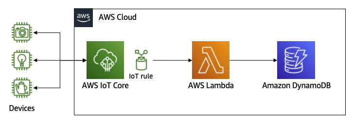
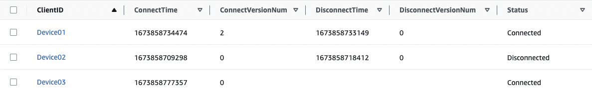

# Connectivity Management Example for AWS IoT Core 

This is a sample solution for managing the connectivity status of devices connected to AWS IoT Core.

You can quickly launch a solution to store device connectivity status in Amazon DynamoDB using lifecycle events of AWS IoT Core.

## Architecture

Using this example, the following architecture is set up.



- Devices connect to IoT Core using MQTT protocol.
- IoT Core publishes [lifecycle events](https://docs.aws.amazon.com/iot/latest/developerguide/life-cycle-events.html) when a device connects to / disconnects from IoT Core.
- When a lifecycle event is published, an IoT rule is triggered and a Lambda function is called.
- The function checks the connectivity of the device using the lifecycle event and its previous status and updates DynamoDB.
- Applications can read the latest connectivity status of a device from DynamoDB.

## Prerequisite

- AWS CLI

## Setup

Execute the following commands.

```bash
# Clone the repository
git clone https://github.com/aws-samples/connectivity-management-example-for-aws-iot-core.git

# Create a zip file for Lambda function
cd iot-core-lifecycle-event-connectivity
zip -r lambda_function lambda_function.py lifecycle/

# Replace REGION with the name of the region where you want to deploy this solution (e.g. us-east-1)
REGION=<sepcify-your-region>

# Create a S3 bucket to upload a zip file
# Replace the value of BUCKET_NAME with a unique bucket name (e.g. device-connectivity-lambda-20230123)
BUCKET_NAME=<specify-your-bucket-to-upload-zip-file>
aws s3api create-bucket --region ${REGION} --bucket ${BUCKET_NAME} --create-bucket-configuration LocationConstraint=${REGION}

# Upload a zip file to the S3 bucket
aws s3 cp lambda_function.zip s3://${BUCKET_NAME}/lifecycle/lambda_function.zip

# Create a CloudFormation stack
aws cloudformation create-stack \
  --region $REGION \
  --stack-name IoTLifeCycleEventStack \
  --template-body file://cfn.yaml \
  --capabilities CAPABILITY_IAM \
  --parameters ParameterKey=BucketName,ParameterValue=${BUCKET_NAME}
```

Wait 5 minutes and confirm the result of the following command will be `CREATE_COMPLETE`.

```bash
aws cloudformation describe-stacks --region ${REGION} --stack-name IoTLifeCycleEventStack --query 'Stacks[*].StackStatus'
```

You can confirm the created resources with the following command.

```bash
aws cloudformation list-stack-resources --region ${REGION} --stack-name IoTLifeCycleEventStack
```

## Test

- Connect a device to IoT Core
  - If you're not familiar with IoT Core, you can follow [this quick start guide](https://docs.aws.amazon.com/iot/latest/developerguide/iot-quick-start.html).
- Navigate to `DeviceConnectivity` DynamoDB table from [DynamoDB console](https://console.aws.amazon.com/dynamodbv2/home#tables)
- Select `Explore table items` and confirm a record with the client ID of the device is created

## DynamoDB schema

- `ClientID` (Partition Key): client id of the device
- `ConnectVersionNum`: `versionNumber` field of the latest `connected` lifecycle event
- `DisconnectVersionNum`: `versionNumber` field of the latest `disconnected` lifecycle event
- `ConnectTime`: `timestamp` field of the latest `connected` lifecycle event
- `DisconnectTime`: `timestamp` field of the latest `disconnected` lifecycle event
- `Status`: the connectivity of the device with the client id (`Connected` or `Disconnected`)



## Cleanup

- Delete `IoTLifeCycleEventStack` CloudFormation stack
- Delete `/aws/lambda/LifeCycleEvent` CloudWatch log group
- Delete S3 bucket you've created in the setup process

## Security

See [CONTRIBUTING](CONTRIBUTING.md#security-issue-notifications) for more information.

## License

This library is licensed under the MIT-0 License. See the LICENSE file.


